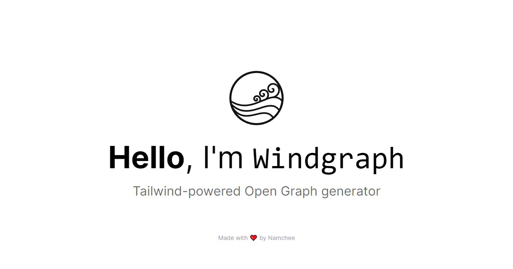
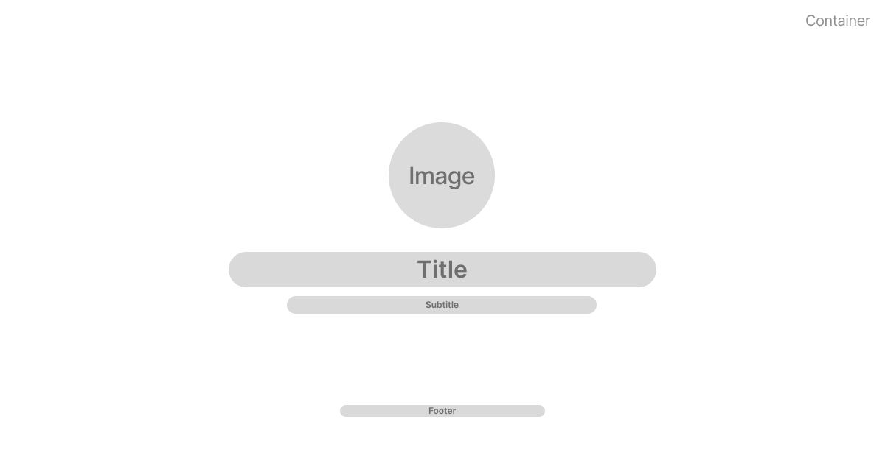
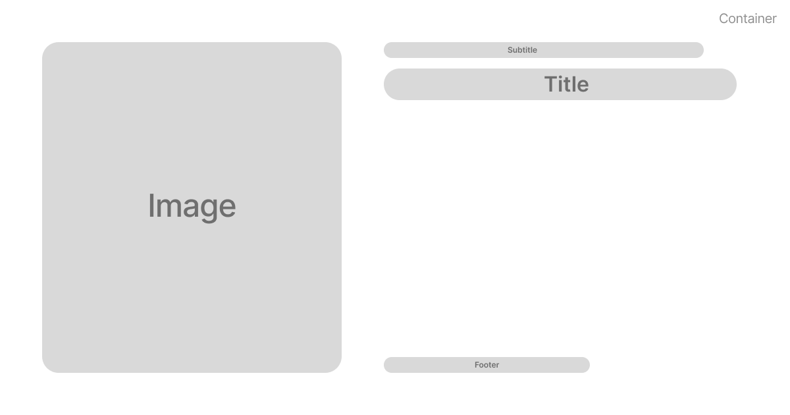

  

Windgraph is a service that lets you generate a dynamic, Tailwind-powered Open Graph images that you can use either for SEO or just for social images.

Inspired by [Vercel's original og-image](https://github.com/vercel/og-image).

> Windgraph is still on active development. The API may change without prior notice.

## Features

- Markdown syntax support
- Batteries-included default styling
- Latest Tailwind features, including [arbitrary values](https://tailwindcss.com/docs/adding-custom-styles#using-arbitrary-values)
- Customizable fonts powered by [Google Fonts](https://fonts.google.com/)

## Open Graph Template

Currently, there are 3 pre-made templates that can be used to generate Open Graph images. 

### `hero`

### `image-left`

### `image-right`

You must specify the template you want to use in form of querystring.

If `template` is omitted, `windgraph` won't be using any template at all and styling is left to the user.

> Feel free to request a template by submitting an issue.

## API

GET - `/api/og/<title>?<query>`

Generate an open graph image based on user's input and template.

### Parameters

Name | Description
---- | -----------
`title` | Image title, supports Markdown syntax. **REQUIRED**

### Query

Name | Description
---- | -----------
`subtitle` | Open Graph subtitle, supports Markdown syntax.
`footer` | Open Graph footer, supports Markdown syntax.
`image` | Image source, must be an accessible URL that responds with an image.
`width` | Output image width in pixels. Defaults to `1200`
`height` | Output image height in pixels. Defauls to `630`
`container-class` | Tailwind CSS classes to be injected to main container. Defaults to `w-screen h-screen p-16 flex flex-col justify-center items-center`
`title-class` | Tailwind CSS classes to be injected to `title`. Defaults to `text-center text-7xl leading-relaxed`
`subtitle-class` | Tailwind CSS classes to be injected to `subtitle`. Defaults to `text-center text-2xl`
`image-class` | Tailwind CSS classes to be injected to `image`. Defaults to `w-full h-auto max-w-[40vh]`
`footer-class` | Tailwind CSS classes to be injected to `footer`. Defaults to `text-center text-sm`
`font-sans` | Sans serif fonts to be used. Defaults to Tailwind's default
`font-serif` | Serif fonts to be used. Defaults to Tailwind's default. Must be used with `font-serif` class.
`font-mono` | Monospaced fonts to be used. Defaults to Tailwind's default. Automatically used on code blocks.
`format` | Image format. Allowed values are `jpeg` and `png`. By default, `jpeg` is compressed to 80% quality. Defaults to `jpeg`
`compress` | Boolean value that represents if the image should be compressed or not. This parameter allows for finer compression compared to the default `jpeg` compression. Default to `false`
`template` | Template name. 

## Showcase

`https://windgraph.vercel.app/api/og/**Hello**%20I'm%20Windgraph?template=hero&title-class=text-white%20mb-4&subtitle=by%20Namchee&subtitle-class=text-white&font-sans=Inter&container-class=bg-gradient-to-b%20from-fuchsia-500%20via-red-600%20to-orange-400`

### With Background Image 

You can use images or inline SVG as a background by utilizing Tailwind's [arbitrary values](https://v2.tailwindcss.com/docs/just-in-time-mode#arbitrary-value-support). For example: 

`https://windgraph.vercel.app/api/og/**Hello**,%20I'm%20%60Windgraph%60?title-class=text-white%20mb-4&container-class=bg-cover%20bg-[url(%27https://raw.githubusercontent.com/Namchee/windgraph/master/docs/background.jpg%27)]&subtitle=by%20Namchee&subtitle-class=text-white&template=hero`

### Using Other Templates

`https://windgraph.vercel.app/api/og/useEffect%20vs%20useLayoutEffect?subtitle=Check%20Out%20This%20Article&image=https%3A%2F%2Fimages.unsplash.com%2Fphoto-1518050947974-4be8c7469f0c&template=image-right&subtitle-class=mb-4%20text-2xl%20text-gray-400&title-class=text-white%20text-6xl%20leading-tight%20font-medium&container-class=bg-gray-900&font-sans=Inter&footer=Made%20by%20Namchee.%20Inspired%20by%20Kent%20C.%20Dodds%20article&footer-class=text-xl%20text-gray-400&image-class=w-full%20h-full`

## FAQ

### Can I avoid the markdown feature?

To avoid markdown processing, you can escape markdown characters by prepending it with `\` or `%5C`. For example:

`https://windgraph.vercel.app/api/og/%5C*%5C*Hello%5C*%5C*,%20I'm%20%60Windgraph%60?title-class=mb-4%20text-white&container-class=bg-gradient-to-b%20from-rose-400%20via-fuchsia-500%20to-indigo-500&subtitle=by%20Namchee&subtitle-class=text-white&template=hero`

### I'm using `image-left` / `image-right` template but `space-x-{value}` is not working properly!

As all provided templates is created using CSS grid, it is recommended to use [gap utilities](https://tailwindcss.com/docs/gap) instead to ensure 100% compatibility.

## Limitations

Besides the limit of Tailwind itself, there are two main limitations of using Windgraph:

### Static Template

Currently you cannot use any other form of template other than the provided one. This will be addressed in future release where you can craft template and use it for your personal use.

### URL Length Limitation

While there are no actual limitations for URL length according to [RFC 2616](http://www.faqs.org/rfcs/rfc2616.html), it's recommended to keep the URL length to 2048 characters at maximum. Bearing that in mind, you shouldn't add too much Tailwind classes or using too much arbitrary values that contains long values.

## License

This project is licensed under the [MIT License](./LICENSE)

## Credits

- Background image in background image customization demonstration is taken by <a href="https://unsplash.com/@jrkorpa?utm_source=unsplash&utm_medium=referral&utm_content=creditCopyText">Jr Korpa</a> on <a href="https://unsplash.com/s/photos/neon?utm_source=unsplash&utm_medium=referral&utm_content=creditCopyText">Unsplash</a>
- Image in image right sample is taken by <a href="https://unsplash.com/@stephenfjohnson?utm_source=unsplash&utm_medium=referral&utm_content=creditCopyText">Stephen Johnson</a> on <a href="https://unsplash.com/s/photos/lights?utm_source=unsplash&utm_medium=referral&utm_content=creditCopyText">Unsplash</a>
  
  
