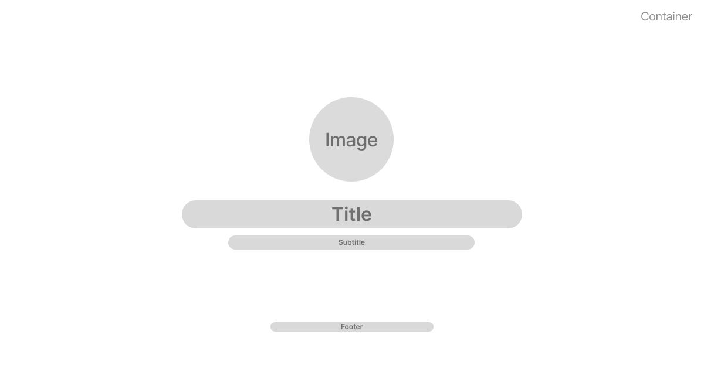
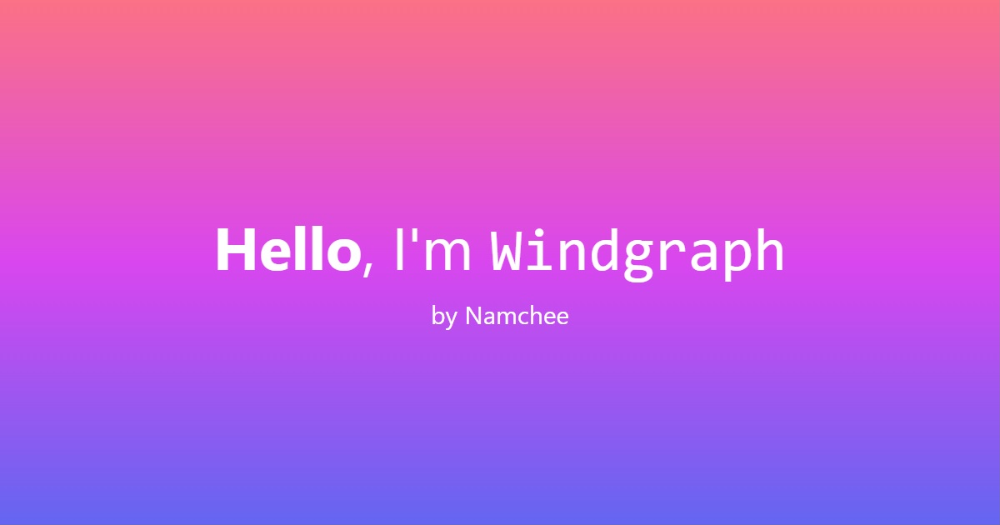

<h1 align="center">
  Windgraph
</h1>

Windgraph is a service that lets you generate a dynamic, Tailwind-powered Open Graph images that you can use either for SEO or just for social images.

Inspired by [Vercel's original og-image](https://github.com/vercel/og-image).

## Features

- Markdown styling
- Sensible default styles
- Latest Tailwind features, including [arbitrary values](https://tailwindcss.com/docs/adding-custom-styles#using-arbitrary-values)
- Customizable fonts powered by [Google Fonts](https://fonts.google.com/)

## Open Graph Template

By default, windgraph will generate images in the following structure.

## API

GET - `/api/og/<title>?<query>`

Generate an open graph image based on user's input and template.

### Parameters

Name | Description
---- | -----------
`title` | Image title, supports Markdown syntax. **REQUIRED**

### Query

Name | Description
---- | -----------
`subtitle` | Image subtitle, supports Markdown syntax.
`image` | Hero image, must be an URL that responds with an image.
`width` | Image width in pixels. Defaults to `1200`
`height` | Image height in pixels. Defauls to `630`
`container-class` | Tailwind CSS classes to be injected to main container. Defaults to `w-screen h-screen p-16 flex flex-col justify-center items-center`
`title-class` | Tailwind CSS classes to be injected to `title`. Defaults to `text-center text-7xl leading-relaxed`
`subtitle-class` | Tailwind CSS classes to be injected to `subtitle`. Defaults to `text-center text-2xl`
`image-class` | Tailwind CSS classes to be injected to `image`. Defaults to `w-full h-auto max-w-[40vh]`
`font-sans` | Sans serif fonts to be used. Defaults to Tailwind's default
`font-serif` | Serif fonts to be used. Defaults to Tailwind's default. Must be used with `font-serif` class.
`font-mono` | Monospaced fonts to be used. Defaults to Tailwind's default. Automatically used on code blocks.

### Example

`https://windgraph.vercel.app/api/og/**Hello**,%20I'm%20%60Windgraph%60?title-class=text-white&container-class=bg-gradient-to-b from-rose-400 via-fuchsia-500 to-indigo-500&subtitle=by Namchee&subtitle-class=text-white`

## License

This project is licensed under the [MIT License](./LICENSE)
